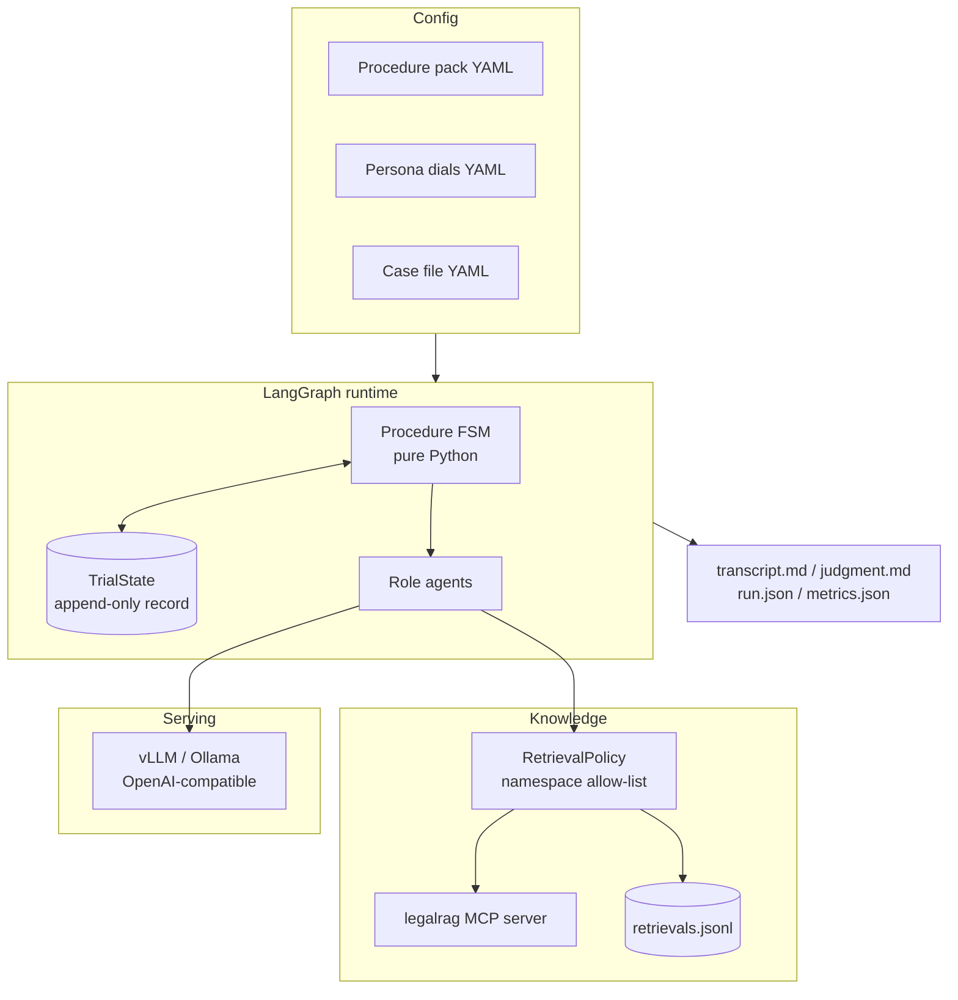
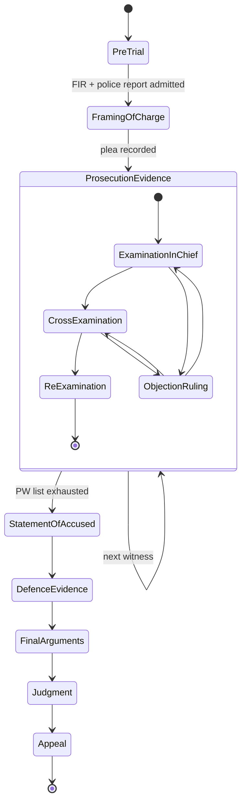
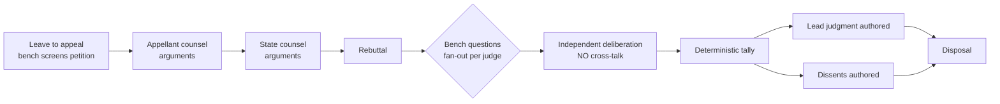

# Courtroom Simulation — Master Plan

**Audience:** Claude Code (and future me).
**Status:** spec, not code. Build in milestone order; do not skip M0.

---

## 0. One-paragraph summary

A multi-agent simulation of a criminal trial and its appeal under the Pakistani judicial system. Every courtroom role is an LLM agent with its own private knowledge base, retrieved through an existing `legalrag` MCP server. Court procedure is a **deterministic state machine** written in plain Python; agents only decide *what to say*, never *who speaks next*. Adjudication happens in two tiers: a single Sessions Judge delivers the trial judgment, and on appeal a Supreme Court bench of personality-varied judges each reach an independent conclusion, after which a deterministic tally picks the majority and an authoring agent writes the lead judgment plus dissents. Models are local (vLLM or Ollama). The whole thing doubles as an evaluation harness for the RAG project.

---

## 1. Decisions locked in

| Decision | Choice | Rationale |
|---|---|---|
| Jurisdiction | **Pakistan**, criminal track (Sessions trial → Supreme Court appeal) | Requested; corpus is in English; statutes are freely available |
| Orchestration | **LangGraph** | Procedure is a phase graph with strict turn-taking. CrewAI's manager-delegates-autonomously model actively fights that. LangGraph gives explicit state, checkpointing, resumable runs, fan-out for the bench |
| Models | **Local, OpenAI-compatible endpoint** (vLLM preferred, Ollama for convenience) | Requested. One code path serves both |
| Knowledge | **`legalrag` MCP server** via `langchain-mcp-adapters` | Already exists; `LEGALRAG_EXPERIMENT` env var makes RAG configs swappable |
| Interface | CLI + transcript artifacts first; web UI is M7 | The transcript *is* the product |
| Scope of v1 | Full trial, all phases, all roles | Requested |
| Persistence | SQLite (LangGraph checkpointer + run store) | Zero-ops, resumable |
| Validation | Pydantic v2 everywhere; every agent turn is a structured object | Small local models freewheel without a schema |

---

## 2. The jury problem — read this before writing any code

**Pakistan does not have jury trials.** Trial by jury was phased out; Pakistani criminal trials are decided by a judge alone. So the "panel of jurors with different personalities, each reaching their own conclusion" cannot sit in a Pakistani trial court without inventing an institution that does not exist.

The fix is better than the original design: **move the panel to the appeal**.

The Supreme Court of Pakistan hears criminal appeals as a **bench of multiple judges**. Each judge forms an independent view, opinions can and do split, and a majority judgment is authored while dissenters write separately. That is structurally identical to what you asked for — N deliberating agents with distinct outlooks, plus a final agent that synthesises a binding outcome — and it is legally real.

So:

```
Tier 1  Sessions Court criminal trial   → all adversarial phases, witnesses,
                                           cross-examination, single judge, judgment
Tier 2  Supreme Court criminal appeal   → 3-judge bench, personality-varied,
                                           independent opinions → majority → lead judgment
```

**Architectural consequence:** do *not* hardcode "jury". Define an abstraction:

```python
class DeliberationPanel(Protocol):
    members: list[PanelMember]
    def decision_rule(self, votes: list[Vote]) -> PanelOutcome: ...
```

with two implementations — `SupremeCourtBench` (majority of N, dissents preserved) and `JuryPanel` (12 lay jurors, unanimity, hung-jury state). Jurisdiction then becomes a **config pack**, not a code branch. Pakistan ships in v1; the US jury pack lands in M6 and exists mainly to prove the abstraction holds.

### Two constraints on jurisdiction modelling

1. **Stay in criminal appellate jurisdiction, not constitutional jurisdiction.** Pakistan's constitutional-adjudication architecture has been restructured twice in the last two years. <cite index="4-1">The 26th Amendment (October 2024) introduced constitutional benches within the Supreme Court to hear cases requiring interpretation of the Constitution</cite>, and <cite index="11-1">the 27th Amendment (November 2025) created a separate Federal Constitutional Court</cite>, <cite index="13-1">whose first Chief Justice was sworn in under Article 175B</cite>. Both amendments are politically contested and <cite index="11-1">are themselves the subject of pending petitions</cite>. Ordinary criminal appellate jurisdiction is the stable part of the system — anchor v1 there and leave a `pk_constitutional.yaml` procedure pack as a later, clearly-labelled add-on.
2. **Use fictional or fully anonymised parties.** No real living individuals as accused, complainant, or judge. Cases get synthetic names (`State v. A.K.`).

---

## 3. The one design principle that matters

> **A courtroom is a protocol, not a conversation.**

Separate the layers ruthlessly:

| Layer | Deterministic? | Owns |
|---|---|---|
| **Procedure** | Yes, pure Python | Phase transitions, who may speak, what acts are legal, admissibility gates, vote tallies, verdict rules |
| **Agents** | No, LLM | The *content* of a permitted speech act |
| **Knowledge** | Deterministic wrapper over stochastic retrieval | Which namespaces a role may query; audit log |
| **Record** | Yes | Append-only transcript, expunged material, exhibits |
| **Adjudication** | Tally is deterministic; opinion text is LLM | Majority computation, judgment authoring |

If an LLM ever decides turn order, who won, or whether evidence is admissible-in-fact, the simulation stops being a simulation. **Never let the model count the votes.**

---

## 4. Architecture



### 4.1 State

```python
class TrialState(TypedDict):
    case: CaseFile                      # immutable
    procedure: ProcedurePack            # immutable
    phase: Phase
    record: Annotated[list[RecordEntry], operator.add]   # append-only, THE shared truth
    expunged: Annotated[list[RecordEntry], operator.add] # struck material, kept for audit
    exhibits: dict[str, Exhibit]
    charges: list[Charge]
    witness_queue: list[WitnessRef]
    current_witness: str | None
    examination_mode: Literal["chief", "cross", "re_exam"] | None
    pending_objection: Objection | None
    private: dict[str, list[str]]       # agent_id -> notes; NEVER read into another agent's context
    opinions: list[JudicialOpinion]
    judgment: Judgment | None
    metrics: RunMetrics
```

**Invariant to test explicitly:** an adjudicator's prompt is built *only* from `state.record` (plus its own `private[agent_id]` and its own retrievals). Never from `expunged`, never from another agent's private notes. Write a unit test that asserts this by constructing a poisoned state.

### 4.2 Trial phase graph (Sessions Court, criminal)



Roles present: Presiding Judge, Public Prosecutor, Defence Counsel, Accused, Complainant, Prosecution Witnesses (PWs), Investigating Officer, Court Reader (rules-based, no LLM).

Notable phase semantics to encode in the procedure pack:
- **Framing of charge** — the court frames the charge and records the plea; if the accused pleads guilty the graph short-circuits to `Judgment`.
- **Statement of the accused** — taken by the court, *not on oath*, and the accused is **not subject to cross-examination** on it. This is a distinctive feature of Pakistani criminal procedure and a good test of whether your FSM is really enforcing speaking rights: the prosecutor node must be structurally unreachable during this phase.
- **Defence evidence** is optional; the accused may separately elect to testify on oath, and if he does, he *is* cross-examinable.
- **Standard of proof** — beyond reasonable doubt, with the benefit of doubt going to the accused. Encode as an explicit `verdict_rule` field, not as a prompt instruction.

> ⚠️ **Verify every section number against the bare acts** (Pakistan Penal Code 1860, Code of Criminal Procedure 1898, Qanun-e-Shahadat Order 1984) before shipping. Put the statutes in the RAG corpus and make the procedure pack cite section numbers, so mistakes are findable rather than buried in prompts. I am describing the shape of the procedure from general knowledge, not from a verified reading of the current text.

### 4.3 Appeal graph (Supreme Court, criminal appellate)



**The final agent** = the opinion author. It receives the record, all individual opinions, and the *already-computed* majority, and writes the binding judgment. It does not get to decide the outcome.

**Independent-then-conference is deliberate.** Run deliberation with no visibility between judges first, record those votes, then optionally run one conference round where judges see each other's reasoning and may revise. Persist **both** vote sets. Agreement collapse — every agent converging on whoever spoke first — is the single most likely failure mode of a multi-agent panel, and this design measures it instead of hiding it.

---

## 5. Personas as dials, not prose

Write personas as **numeric dials** rendered into prompt text at runtime. Prose personas cannot be swept, ablated, or correlated with outcomes; dials can.

```yaml
# configs/personas/bench_pk.yaml
- id: judge_a
  label: "Formalist"
  dials:
    textualism: 0.9              # 0 purposive ... 1 strictly textual
    deference_to_trial_findings: 0.8
    weight_on_procedural_irregularity: 0.4
    benefit_of_doubt_threshold: 0.3   # low = acquits readily
    precedent_anchoring: 0.9
    verbosity: 0.4
- id: judge_b
  label: "Purposive / rights-leaning"
  dials:
    textualism: 0.2
    deference_to_trial_findings: 0.3
    weight_on_procedural_irregularity: 0.9
    benefit_of_doubt_threshold: 0.7
    precedent_anchoring: 0.5
    verbosity: 0.8
```

A `PersonaRenderer` turns dials into second-person instruction text. Keep the mapping in one file so it can be tuned once and applied everywhere.

For the US jury pack, the dial set changes (deference to authority, risk aversion, prior trust in police testimony, need for closure) but the machinery is identical.

**Hard rule:** every member of a panel runs the **same base model**. Different models across judges confounds persona effects with capability effects and destroys the experiment.

---

## 6. RAG integration

### 6.1 Wiring

The server is launched as:

```bash
LEGALRAG_EXPERIMENT=e0_naive_baseline python -m legalrag.service.mcp_server
```

Connect over stdio so the courtroom process owns the server lifecycle and the experiment variable:

```python
from langchain_mcp_adapters.client import MultiServerMCPClient

client = MultiServerMCPClient({
    "legalrag": {
        "command": sys.executable,
        "args": ["-m", "legalrag.service.mcp_server"],
        "transport": "stdio",
        "env": {**os.environ, "LEGALRAG_EXPERIMENT": settings.rag_experiment},
    }
})
raw_tools = await client.get_tools()
```

**Do not let agent code touch `raw_tools` directly.** Put an adapter behind a stable protocol so that if the MCP tool names or signatures change, exactly one file changes:

```python
class LegalRetriever(Protocol):
    async def search(
        self, query: str, namespaces: list[str], k: int = 6
    ) -> list[RetrievedChunk]: ...
```

`RetrievedChunk` carries `doc_id`, `text`, `score`, `namespace`, and a `citation` string. Discover the actual tool schema first (`await client.get_tools()` and print it), then write the adapter to match — do not guess parameter names.

### 6.2 Namespaces and isolation

Per-agent knowledge is the point of the project, so enforce it in code rather than trusting prompts.

| Namespace | Contents | Who may read |
|---|---|---|
| `statutes` | PPC, CrPC, Qanun-e-Shahadat, Constitution | everyone |
| `precedent` | Reported judgments (PLD / SCMR / MLD) | judges, counsel |
| `case:{id}:record` | FIR, police report, exhibits, transcript-so-far | everyone |
| `role:prosecution:{id}` | Prosecution theory, witness prep notes | Public Prosecutor only |
| `role:defence:{id}` | Defence theory, privileged instructions | Defence Counsel only |
| `role:witness:{name}` | That witness's own recollection, including facts *not* in the record | that witness only |
| `role:judge:{id}` | Bench notes, jurisprudential leanings | that judge only |

Witness-private namespaces are what make cross-examination non-trivial: the witness knows more than the record shows, may be inconsistent, and can be impeached. Without them, cross-examination degenerates into paraphrase.

```python
class RetrievalPolicy:
    ALLOW: dict[Role, list[str]] = {...}
    def check(self, role: Role, namespaces: list[str]) -> None:
        illegal = set(namespaces) - set(self.resolve(role))
        if illegal:
            raise KnowledgeBoundaryViolation(role, illegal)
```

Every retrieval is appended to `runs/{run_id}/retrievals.jsonl` with role, phase, query, namespaces, returned `doc_id`s and scores. This log is simultaneously the courtroom's audit trail **and** a labelled evaluation set for the RAG project — real queries, real context, real downstream consequences. That is a genuinely better eval corpus than synthetic question sets.

### 6.3 The record becomes retrievable

Trial transcripts outgrow context windows fast. Index the growing transcript into `case:{id}:record` after each phase. Agents then get: a pinned verbatim tail (last N turns), a rolling structured summary, and retrieval over the full record for anything older. This is also more realistic — advocates consult the record, they do not memorise it.

---

## 7. Model serving

Serve over an OpenAI-compatible endpoint so vLLM and Ollama are interchangeable:

```python
ChatOpenAI(base_url=settings.llm_base_url, api_key="local", model=cfg.model, temperature=cfg.temperature)
```

### 7.1 Suggested assignment

| Role | Size class | Why |
|---|---|---|
| Appellate judges + opinion author | Largest that fits | Long-form reasoning, citation discipline |
| Trial judge | Same class as above | Writes the judgment |
| Prosecution / defence counsel | Mid | Argument quality drives the whole trial |
| Witnesses, accused, complainant | Small | Short turns; persona consistency matters more than reasoning depth |
| Court reader / clerk | **No LLM** | It is string formatting |

Rough VRAM guidance (4-bit): ~5 GB for 7–8B, ~9 GB for 14B, ~20 GB for 32B, before KV cache. Budget context generously — the record is the bottleneck, not the weights. On 8 GB, run 7–8B everywhere and accept shallower reasoning; on 24 GB, run a 32B for judges and 7–8B for witnesses.

### 7.2 Prefix caching — do this, it is free

With `vllm serve --enable-prefix-caching`, N judges deliberating on the same record share one prefill instead of N. To get the cache hit, the **common part must come first**:

```
[system]  identical across all panel members
[user]    <<< FULL RECORD >>>          ← identical, cached
          <<< YOUR PERSONA >>>          ← differs per judge
          <<< YOUR TASK >>>
```

Putting persona in the system prompt is the intuitive choice and it defeats the cache entirely. With a 20k-token record and 3 judges this is roughly a 3× prefill saving; with a 12-juror panel it is transformative.

Also fan the panel out with `asyncio.gather` — LangGraph parallel nodes. Set `OLLAMA_NUM_PARALLEL` if using Ollama; vLLM batches natively.

### 7.3 Structured output on every turn

```python
class SpeechAct(BaseModel):
    act: Literal["question", "answer", "statement", "argument", "objection", "ruling"]
    addressed_to: str | None = None
    content: str
    citations: list[Citation] = []
    exhibit_refs: list[str] = []

class JudicialOpinion(BaseModel):
    judge_id: str
    disposition: Literal["allow_appeal", "dismiss_appeal", "alter_conviction", "remand"]
    on_each_charge: dict[str, Literal["guilty", "not_guilty"]]
    reasoning: str
    citations: list[Citation]
    confidence: float = Field(ge=0, le=1)
```

Use vLLM guided JSON / Ollama schema-constrained `format`. Add a **retry gate**: an argument or opinion with zero citations when retrieval returned results is rejected and re-generated once, then flagged in metrics. This is the cheapest available defence against a small model inventing law.

---

## 8. Repository layout

```
courtroom-sim/
├── pyproject.toml
├── CLAUDE.md                       # condensed build rules (see §12)
├── configs/
│   ├── settings.yaml
│   ├── procedures/
│   │   ├── pk_sessions_criminal.yaml
│   │   ├── pk_supreme_criminal_appeal.yaml
│   │   └── us_criminal_jury.yaml        # M6
│   ├── personas/{bench_pk.yaml,jury_us.yaml}
│   └── cases/state_v_ak.yaml
├── src/courtroom/
│   ├── domain/          # CaseFile, Charge, Exhibit, RecordEntry, Judgment, SpeechAct
│   ├── procedure/       # pack loader, phase FSM, speaking rights, verdict rules
│   ├── agents/          # base, judge, counsel, witness, accused, panel, author
│   ├── knowledge/       # mcp_client, retriever adapter, policy, audit
│   ├── llm/             # factory, structured, prompt_layout (prefix-cache aware)
│   ├── graph/           # state, trial_graph, appeal_graph, nodes/
│   ├── record/          # transcript store + md/json/html renderers
│   ├── eval/            # metrics, harness, sweeps
│   └── cli.py
├── tests/
└── runs/{run_id}/       # transcript.md, judgment.md, run.json, retrievals.jsonl, metrics.json
```

---

## 9. Milestones

Each milestone has a binary acceptance test. Do not start the next one until it passes.

### M0 — Skeleton and contracts *(no LLM, no RAG)*
Domain models, procedure-pack schema and loader, the full phase FSM, a `FakeLLM` returning canned speech acts, a `FakeRetriever` returning fixed chunks, CLI wiring, transcript renderer.
**Accept:** `courtroom run --case state_v_ak --dry-run` produces a complete, procedurally valid trial transcript with **zero** model calls, in under a second. Property test: 10,000 random agent outputs never drive the FSM into an illegal state.

*This is the most important milestone in the plan.* Every expensive bug you avoid later is avoided here.

### M1 — LLM layer
Model factory, structured decoding, prefix-cache-aware prompt layout, token/latency accounting, seeded determinism.
**Accept:** same seed + temperature 0 → byte-identical transcript across two runs. Token counts reported per role.

### M2 — Knowledge layer
MCP client, retriever adapter, `RetrievalPolicy`, audit log, transcript indexing.
**Accept:** a prosecution agent attempting `role:defence:*` raises `KnowledgeBoundaryViolation`; `retrievals.jsonl` is complete for a full run.

### M3 — Trial tier
All roles live, witness examination loop, objections and rulings, striking evidence, statement of the accused, final arguments, judgment.
**Accept:** end-to-end Sessions trial on a seeded case; judgment cites at least one statutory provision that resolves to a real retrieved chunk; struck testimony appears in `expunged` and **not** in `record`.

### M4 — Appeal tier
Bench construction from persona dials, parallel independent opinions, deterministic tally, conference round, lead judgment + dissents.
**Accept:** a 3-judge bench produces a 2–1 split on at least one seeded case; the dissent is substantively different from the majority, not a paraphrase; pre- and post-conference votes are both persisted.

### M5 — Evaluation harness
Metrics (§10), experiment sweeps across `LEGALRAG_EXPERIMENT` × persona configs, results table.
**Accept:** one command runs the same case under ≥2 RAG configurations and emits a comparison table including verdict-flip rate.

### M6 — US jury procedure pack
Second procedure pack + `JuryPanel` with unanimity and a hung-jury terminal state.
**Accept:** switching one config value runs a US jury trial with **no changes to `src/`**. If `src/` needs editing, the abstraction was wrong — fix it here, not later.

### M7 — Web UI *(optional)*
FastAPI + SSE streaming, courtroom view, live transcript, retrieval inspector.

---

## 10. Evaluation — how you know it works

| Metric | Definition | Why it matters |
|---|---|---|
| **Procedural validity** | % of turns that are legal moves | Should be 100% by construction; any deviation is a bug in the FSM, not the model |
| **Citation groundedness** | % of citations resolving to an actually-retrieved chunk | The headline metric; directly evaluates your RAG |
| **Hallucinated-authority rate** | Citations to non-existent sections or judgments | Small models invent case law confidently |
| **Struck-evidence leakage** | Does adjudicator reasoning reference `expunged` content? | Excellent, cheap, novel-ish metric — humans fail this too |
| **Persona sensitivity** | Correlation between dial values and votes | If the dials do nothing, the personas are decorative |
| **Agreement collapse** | Δ between pre- and post-conference votes | Detects sycophantic convergence |
| **Outcome sensitivity to RAG** | Verdict-flip rate across `LEGALRAG_EXPERIMENT` values | *Does retrieval quality change judicial outcomes?* This is the interesting research question your setup can actually answer |
| **Determinism** | Byte-identical transcript at temp 0, fixed seed | Prerequisite for all of the above |

**Contamination warning:** if you validate against real reported cases, famous judgments may be memorised by the base model, so matching the real disposition proves nothing. Anonymise party names, alter dates and immaterial facts, and prefer less-cited cases.

---

## 11. Risks and mitigations

| Risk | Mitigation |
|---|---|
| Small local models produce shallow legalese | Structured outputs, narrow per-turn scope, citation retry gate, larger model for judges only |
| Record outgrows context | Rolling summary + pinned verbatim tail + retrieval over the transcript (§6.3) |
| Panel converges on the first speaker | Independent deliberation before any conference round; measure the delta |
| Legal procedure is subtly wrong | Ship the bare acts into the corpus; make procedure packs cite section numbers; get a law student to read `pk_sessions_criminal.yaml` — it is one file, that review is an afternoon |
| Cost/time blowup | M0 dry-run mode, prefix caching, no LLM for the clerk, `--max-witnesses` cap |
| Simulation mistaken for legal reasoning | Stamp every artifact: *simulation output, not legal advice*; fictional parties only |
| Constitutional jurisdiction is in flux | v1 stays in criminal appellate jurisdiction (§2) |

---

## 12. Rules for the build (put a condensed version in `CLAUDE.md`)

1. **The FSM is the source of truth.** Agents never choose the next speaker, never decide who won, never rule on their own admissibility.
2. **Never let the model count the votes.** Tally in Python. The author agent receives the result, it does not produce it.
3. **Every agent turn is a validated Pydantic object.** No free-text parsing anywhere.
4. **Knowledge isolation is enforced in code**, not in prompts. A prompt saying "do not look at the defence file" is not a security boundary.
5. **Jurisdiction is configuration.** If adding the US jury pack requires touching `src/`, the abstraction is wrong.
6. **M0 ships before any model call.** Dry-run mode stays working forever; it is the regression test.
7. **One base model per panel.** Always.
8. **Log every retrieval.** It is the audit trail and the RAG eval set.
9. Type hints everywhere, `ruff` + `mypy` in CI, `pytest` for the FSM property tests.

---

## 13. Open questions to settle before M3

- Which specific offence to model first? A single-accused, few-witness offence (e.g. a straightforward theft or hurt case) keeps the first end-to-end run tractable; murder cases pull in complications like dying declarations and medical evidence that are better added in M5.
- Bench size for the appeal: 3 is the sensible default and keeps splits readable. 5 gives richer vote distributions at ~1.7× cost.
- Are the case files hand-authored, generated, or drawn from anonymised reported judgments? Hand-author the first one — you need a gold-standard case you fully understand before you can tell whether the sim is behaving.
- Language: English-only for v1. Pakistani superior-court judgments are written in English, so the corpus supports it, but trial-court testimony realistically involves Urdu. Bilingual witnesses are a legitimate later feature, not a v1 concern.
