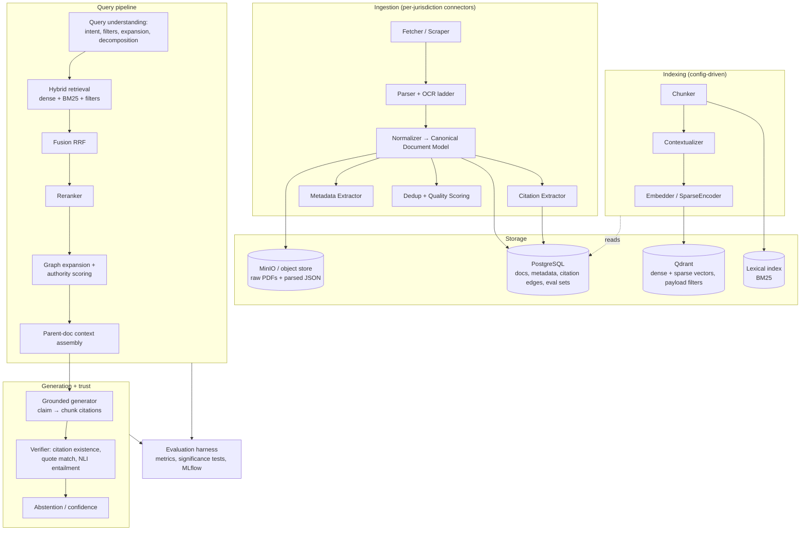

# Legal-RAG — Master Implementation Plan

> **Status:** Draft v1 · 2026-07-18
> **Mode:** Academic research first; every component modular and replaceable so advanced RAG techniques can be tested, combined, and ablated.
> **Tracks:** `jurisdiction/us` (prototype pipeline) → `jurisdiction/pakistan` (research target) → `jurisdiction/multi` (future prospect). Shared core lives on `main`.

---

## 1. Vision and research framing

### 1.1 Problem

Legal research over large judicial corpora (case law, statutes, casefiles) is slow, expensive, and unevenly accessible. General-purpose LLMs are unusable for this unaided: Stanford HAI's 2024 studies measured hallucination rates of 58–82% on legal queries for frontier chatbots, and 17–33% *even for commercial legal AI tools* (Lexis+ AI, Westlaw AI). Courts have already sanctioned lawyers for filing briefs with fabricated citations (*Mata v. Avianca*, S.D.N.Y. 2023). A legal RAG system is only useful if it is **grounded, verifiable, and citation-faithful** — which makes it an excellent stress test for advanced RAG methodology.

This project builds a research platform for advanced RAG over judicial corpora, with three goals:

1. **Prototype (US corpus):** a working end-to-end pipeline on high-resource open data (Caselaw Access Project, CourtListener) where public benchmarks exist, so techniques can be measured against the literature.
2. **Research target (Pakistan):** transfer and adapt the validated pipeline to Pakistan's judiciary — a low-resource jurisdiction with no public IR benchmark, distinct citation conventions (PLD/SCMR/CLC), scan-heavy PDFs, and partial Urdu content. Building the first Pakistani legal-RAG evaluation set is itself a contribution.
3. **Future prospect (Multi-jurisdiction):** extract the jurisdiction-neutral core + adapter architecture so one engine serves heterogeneous legal systems — directly motivated by the fact that Pakistani courts routinely cite UK and Indian precedent, so even the "single-jurisdiction" target benefits from a cross-jurisdiction citation graph.

### 1.2 Why legal RAG is hard (domain constraints that shape the design)

| Constraint | Design consequence |
|---|---|
| Judgments are long (10–300+ pages), hierarchically structured (facts → issues → holdings), with numbered paragraphs | Structure-aware chunking; parent–child (small-to-big) retrieval; stable paragraph IDs for pinpoint citation |
| Dense cross-referencing: cases cite cases and statutes; precedent gets followed/distinguished/overruled | Citation extraction + normalization; citation knowledge graph; treatment-aware authority scoring |
| Authority is hierarchical (Supreme Court ≻ High Court ≻ district) and jurisdiction-bound | Metadata-filtered retrieval; authority-weighted reranking |
| Statutes change over time (amendment, repeal) | Point-in-time document versioning |
| Vocabulary mismatch: lay/lawyer queries vs. terms of art | Query understanding: expansion, HyDE, decomposition, self-query metadata extraction |
| Hallucinated citations are catastrophic | Mandatory grounded generation + deterministic citation verification + entailment checking + calibrated abstention |
| Exact strings matter (citations, section numbers, defined terms) | Hybrid retrieval — lexical/sparse is not optional in legal IR |
| Source documents are untrusted input | Prompt-injection hygiene for ingested text; verifier runs outside the generator |

### 1.3 Research questions

- **RQ1 — Retrieval architecture:** Which retrieval configurations (hybrid sparse+dense, contextual embeddings, late-interaction, reranking) maximize retrieval quality on long, citation-dense legal documents, at what latency/cost?
- **RQ2 — Domain specialization:** How much do legal-specific components (legal-tuned embeddings, structure-aware chunking, citation-graph signals) improve over strong generic RAG baselines?
- **RQ3 — Verifiable generation:** Can a grounded-generation + verification stack drive hallucinated-citation rate to ≈0 while preserving answer quality and coverage (abstaining no more than necessary)?
- **RQ4 — Low-resource transfer:** How do techniques validated on a high-resource corpus (US) transfer to Pakistan's judiciary (different citation grammar, OCR noise, no benchmarks)? Which components break, and what adaptation is required?
- **RQ5 — Generalization:** What is the minimal jurisdiction-adapter abstraction that lets one engine serve multiple legal systems, including cross-jurisdiction citation traversal?

### 1.4 Success criteria / intended contributions

1. Reproducible experiment platform where a full RAG configuration is a config file, and every result is tracked (config hash + corpus snapshot + code commit).
2. Measured ablation ladder (E0–E10, §7) on public US benchmarks (CLERC primary), with statistical significance testing — publishable as a systematic study (RQ1–RQ3).
3. **PakLegalQA**: first expert-validated Pakistani legal QA + retrieval evaluation set (~300–500 items), plus `pk-cite`, an open-source Pakistani citation extractor (analogous to eyecite) (RQ4).
4. Transfer study quantifying US→PK degradation per component, with adaptation results (RQ4).
5. Citation-hallucination rate ≈ 0 on evaluated outputs, with abstention calibration curves (RQ3).

---

## 2. Strategy: three tracks, one core

### 2.1 Track map

| Track | Branch | Role | Status |
|---|---|---|---|
| Shared engine + docs | `main` | Canonical schema, component interfaces, eval harness, all cross-track code | Active — everything merges back here |
| US prototype | `jurisdiction/us` | End-to-end pipeline on open US data; benchmark-driven ablations (E0–E10) | **Active first** |
| Pakistan | `jurisdiction/pakistan` | Data acquisition, pk-cite, PakLegalQA, transfer study | Starts Phase 4; groundwork (source audit) can start anytime |
| Multi-jurisdiction | `jurisdiction/multi` | Adapter abstraction, cross-jurisdiction graph, comparative queries | Design notes now; implementation after PK works |

### 2.2 Branch policy (important)

Three long-lived branches can silently fork the engine — every core improvement would need cherry-picking three times. Policy to prevent that:

1. **Core code changes land on `main`** (schema, interfaces, retrieval/generation/eval components). Jurisdiction branches rebase/merge from `main` frequently (at minimum at every phase boundary).
2. Jurisdiction branches contain only jurisdiction-specific work-in-progress: connectors, citation grammars, corpus configs, annex docs, experiments.
3. Code is laid out as `core/` vs `jurisdictions/<x>/` **from day one** (§9.1), so the eventual end-state — folding all tracks into `main` as directories, which is what the multi-jurisdiction track ultimately requires — is a merge, not a rewrite.
4. If a branch discovers a core bug/improvement, it is committed to `main` (or PR'd to `main`) first, then pulled into the branch — never fixed divergently.

---

## 3. Architecture overview

### 3.1 System diagram



### 3.2 Design principles (the "modular and replaceable" contract)

1. **Every stage is a Protocol + registry entry.** `Fetcher`, `Parser`, `CitationExtractor`, `Chunker`, `Contextualizer`, `Embedder`, `SparseEncoder`, `VectorIndex`, `LexicalIndex`, `Retriever`, `Fusion`, `Reranker`, `QueryTransformer`, `GraphExpander`, `ContextAssembler`, `Generator`, `Verifier`, `Evaluator`. New technique = new registered class; no edits to the pipeline runner.
2. **Experiments are configs, not code.** A full RAG system instance is a YAML file naming registered components + their params. Ablations are config diffs.
3. **No framework lock-in.** Thin internal interfaces; LangChain/LlamaIndex are *not* the backbone (their abstractions churn and obscure ablations). Libraries are used as component implementations behind our interfaces (Docling for parsing, eyecite for US citations, bm25s for lexical, etc.).
4. **Provider abstraction (hybrid LLM posture).** One `LLMClient`/`Embedder` interface; implementations for Anthropic API (default: `claude-sonnet-5` workhorse, `claude-opus-4-8` judge/hard synthesis, `claude-haiku-4-5` cheap bulk ops) and OpenAI-compatible local serving (vLLM: Qwen/Llama; TEI or sentence-transformers for local embeddings). Routing per experiment config → confidential corpora can go fully local later without code changes.
5. **Reproducibility is non-negotiable.** Every run records: experiment config hash, corpus snapshot ID, index build ID, code commit, model versions, seed. Corpus + index manifests versioned (DVC with MinIO remote).
6. **Determinism before ML.** Wherever a deterministic check exists (citation exists in DB, quote string-matches source), it outranks a model-based check.

### 3.3 Experiment-as-config workflow

Illustrative experiment config (Hydra-composed):

```yaml
# experiments/e2_hybrid_rerank.yaml
corpus: us/clerc-dev-10k          # corpus snapshot id
index:
  chunker: {name: structure_aware, max_tokens: 512, respect_paragraphs: true}
  contextualizer: {name: none}     # e4 turns on anthropic-style contextual retrieval
  dense: {name: voyage, model: voyage-3-large, dim: 1024}
  sparse: {name: bm25s, k1: 1.5, b: 0.75}
retrieval:
  query_transform: [{name: none}]
  dense_k: 50
  sparse_k: 50
  fusion: {name: rrf, k: 60}
  reranker: {name: bge_reranker_v2_m3, top_k: 10}
  graph_expansion: {name: none}
generation:
  assembler: {name: parent_paragraph, budget_tokens: 12000}
  generator: {name: anthropic, model: claude-sonnet-5, prompt: grounded_v3}
  verifier: {name: full_stack, quote_fuzz: 0.92, nli: minicheck}
eval:
  suites: [clerc_retrieval, clerc_gen_smoke]
  bootstrap_samples: 1000
```

CLI surface (Typer):

```
legalrag ingest   --source us/cap --slice dev-10k
legalrag index    --experiment e2_hybrid_rerank
legalrag query    --experiment e2_hybrid_rerank "..."       # ad-hoc probing
legalrag eval     --experiment e2_hybrid_rerank             # logs to MLflow
legalrag compare  --runs e1,e2 --metric ndcg@10             # significance test
```

---

## 4. Canonical document model

Jurisdiction-neutral core schema; jurisdiction packs supply parsers/extractors that populate it. This model is the contract that makes RQ5 possible and keeps every downstream component jurisdiction-agnostic.

```python
class LegalDocument(BaseModel):
    doc_id: str                    # stable: "{jurisdiction}/{court}/{case_or_act_id}/{version}"
    doc_type: DocType              # judgment | order | statute | rule | pleading | ...
    jurisdiction: str              # "us", "pk", ...
    court: CourtRef | None         # normalized against per-jurisdiction court registry
    title: str                     # parties ("A v. B") or statute name
    case_numbers: list[str]
    citations_self: list[Citation] # how THIS doc is cited (reporter cites, neutral cite)
    judges: list[str]
    decision_date: date | None
    language: str                  # "en", "ur", ...
    version: DocVersion | None     # point-in-time chain for statutes (valid_from/to, predecessor)
    source: Provenance             # url, fetched_at, checksum, license note
    body: list[Section]            # tree: Section -> Paragraph(para_no, text, page_span)
    citations_out: list[CitationMention]  # raw span, normalized, resolved target_doc_id | None,
                                          # treatment: followed|distinguished|overruled|cited|None
    quality: QualityReport         # ocr_confidence, parse_score, dedup_cluster_id

class Chunk(BaseModel):
    chunk_id: str                  # "{doc_id}#{para_start}-{para_end}"
    doc_id: str
    para_ids: list[str]            # pinpoint-citable units
    text: str
    context_prefix: str | None     # contextual-retrieval annotation, embedded but not shown
    payload: dict                  # court_level, decision_date, doc_type, jurisdiction → filters
```

Key decisions:

- **Paragraph is the atomic unit.** Judgments in all target jurisdictions use numbered paragraphs (or can be segmented into stable ones). Answers cite `doc_id ¶ n` — verifiable and human-checkable.
- **Citations are first-class rows** (Postgres `citation_edges(src_doc, tgt_doc, mention_span, treatment)`), not free text — this is the substrate for graph retrieval and for the deterministic citation verifier.
- **Statutes are version chains**; queries carry an as-of date (defaults to today).

---

## 5. Component specifications

Each subsection: responsibility → candidate implementations (things to A/B) → default. Defaults favor: runs-locally, cheap iteration, strong published baselines.

### 5.1 Ingestion

| Stage | Candidates | Default |
|---|---|---|
| Fetch | Per-source connectors (bulk download, API, polite scraper w/ rate limits + checksums) | Bulk-first (CAP static files, CourtListener bulk) |
| Parse (digital PDF) | PyMuPDF, Docling, unstructured | PyMuPDF text-layer + Docling for layout-hard docs |
| OCR ladder (scanned) | Tesseract → Surya/PaddleOCR → VLM OCR (vision LLM) for hardest pages | Escalate by confidence score; log OCR confidence into `quality` |
| Structure recovery | Rule-based paragraph/section segmentation + heading heuristics per jurisdiction | Rule-based; ML later only if measurably needed |
| Citation extraction | US: eyecite + reporters-db. PK: `pk-cite` (ours). | Per-jurisdiction pack |
| Metadata extraction | Regex/rules first; LLM extraction (haiku) for stragglers with schema-validated output | Rules → LLM fallback, always validated |
| Dedup | MinHash/LSH over normalized text (same judgment across sources/reporters) | MinHash, cluster ID kept (don't delete — provenance matters) |

Pipeline properties: idempotent, resumable, per-doc error quarantine (a bad PDF never kills a run), quality dashboard (parse rate, OCR confidence distribution, citation-resolution rate). Orchestration: plain Typer CLI + manifests for research scale; Prefect only if/when scheduled re-crawls matter.

### 5.2 Chunking & indexing (ablation axis A)

Candidates to ablate:
1. Fixed-size recursive (baseline)
2. **Structure-aware**: paragraph-tree chunks that never split a numbered paragraph, carry section-path metadata
3. **Parent–child (small-to-big)**: embed small chunks (1–3 paragraphs), retrieve, expand to parent section for generation
4. **Contextual retrieval** (Anthropic 2024): prepend an LLM-generated chunk-situating sentence before embedding (haiku-generated, cached, one-time cost per corpus snapshot)
5. **Proposition/headnote index**: LLM-extracted holdings as a parallel index routing to source paragraphs
6. RAPTOR-style hierarchical summary tree (stretch; long judgments make it attractive)

### 5.3 Retrieval (ablation axis B)

| Slot | Candidates | Default |
|---|---|---|
| Dense embeddings | voyage-3-large, voyage-law-2 (legal-tuned), OpenAI text-embedding-3-large, BGE-M3 (local, multilingual → Urdu path), GTE/E5 family | API: voyage-3-large · Local: BGE-M3 |
| Sparse | bm25s (fast, in-process), OpenSearch BM25 (scale), SPLADE-v3, BGE-M3 sparse heads | bm25s |
| Late interaction | ColBERTv2/PLAID; ColPali over scanned pages (PK-relevant!) | Off by default; E8 probe |
| Vector store | **Qdrant** (hybrid, payload filters, quantization, runs in docker), pgvector (simplicity), LanceDB (fast local experiments), Milvus (very large scale) | Qdrant |
| Fusion | RRF, weighted linear, learned | RRF k=60 |
| Reranker | BGE-reranker-v2-m3 (local), Cohere Rerank 3.5, Jina v2, LLM-rerank (ceiling probe) | BGE-reranker-v2-m3 |
| Filters | court level, jurisdiction, date range, doc_type — extracted by self-query transformer, enforced as Qdrant payload filters | On |

Embedding cost note: 1M chunks × ~400 tokens ≈ 400M tokens per full-corpus embed. Bake off embedders on the 10k-doc dev corpus first; embed large corpora only with the winner (and prefer local BGE-M3 for bulk/scale tiers).

### 5.4 Query understanding (ablation axis C)

- Intent router (haiku or rules): citation lookup (`"PLD 2018 SC 595"` → direct doc fetch, skip vector search) vs. party-name lookup vs. conceptual research vs. statute lookup vs. multi-hop research question.
- Self-query metadata extraction: "Supreme Court cases after 2015 on bail in NAB references" → filters `{court: SC, date>2015}` + semantic query.
- Expansion: multi-query paraphrase, HyDE (hypothetical judgment paragraph), legal-term normalization.
- Decomposition for comparative/multi-issue questions; conversational condensation for follow-ups.

### 5.5 Citation graph & authority (ablation axis D — the most "legal" component)

- Build: resolved `citation_edges` from ingestion → graph in Postgres, analyzed with NetworkX (research scale is fine; Neo4j only if traversal becomes the bottleneck).
- **Authority score**: court level × recency decay × in-citation count (PageRank variant over citation graph) × negative-treatment penalty.
- **Treatment classifier**: classify the citing sentence (followed/distinguished/overruled/cited) — few-shot LLM to bootstrap labels, then a small fine-tuned classifier; enables "is this still good law?" signals.
- **Graph-expanded retrieval**: after reranking, pull top-cited-by and cites-out neighbors of top hits; merge with authority-weighted scores. (Distinct from Microsoft GraphRAG — this graph is *native* to the domain, not LLM-synthesized.)

### 5.6 Generation

- **Grounded composer**: structured output where every claim carries supporting `chunk_id`s; rendered as answer + pinpoint citations (`Party v. Party, cite, ¶ 12`). Non-cited claims are dropped or flagged.
- Answer modes: direct answer · research memo (IRAC-shaped) · case summary · multi-case comparison table · timeline. Prompt library versioned in-repo; prompts are experiment variables.
- Long-document ops (summarize a 300-page casefile): hierarchical map-reduce over the section tree.
- Models: `claude-sonnet-5` default; `claude-opus-4-8` for memo synthesis + LLM-judge; local vLLM (Qwen3-32B class) as the sovereignty path. All behind `LLMClient`.

### 5.7 Verification & guardrails (RQ3 core)

Ordered stack, deterministic first:
1. **Citation existence**: every cited `doc_id`/citation string must resolve in Postgres. A citation not in the corpus is *never* emitted (this alone kills the *Mata v. Avianca* failure mode).
2. **Quote verification**: quoted spans fuzzy-match source paragraph (rapidfuzz ≥ threshold).
3. **Claim entailment**: MiniCheck (efficient grounding checker) per claim–chunk pair; DeBERTa-NLI fallback; LLM-judge escalation for flagged claims only.
4. **Abstention**: if retrieval confidence low or verification fails → say so explicitly, show best partial sources. Calibration curve measured in eval (answer-rate vs. accuracy trade-off).
5. **Scope guardrails**: legal information, not legal advice; disclaimer surface; injection hygiene (retrieved text is data, never instructions — structural separation in prompts).

### 5.8 Agentic research mode (stretch, E10)

Tool-loop agent (search / fetch-doc / traverse-graph / statute-as-of tools) for multi-hop questions: find leading case → check treatment → confirm current position → compose memo. Claude Agent SDK is the candidate harness; evaluated against single-shot pipeline on the multi-hop eval slice. Only after the deterministic pipeline is measured — agentic variance needs a stable baseline to be interpretable.

---

## 6. Evaluation framework (the research engine — built FIRST, not last)

### 6.1 Datasets & benchmarks

| Suite | Corpus | Role |
|---|---|---|
| **CLERC** (2024) | Built from Caselaw Access Project; case retrieval + retrieval-augmented drafting | **Primary US benchmark** — matches our task exactly |
| COLIEE tasks 1–2 | Case law retrieval/entailment (annual competition data) | Secondary retrieval benchmark |
| LegalBench-RAG | Contracts/privacy corpora (CUAD, MAUD, ContractNLI, PrivacyQA) | Secondary — tests generalization beyond case law |
| LegalBench (selected tasks) | Reasoning tasks | Generation-side probes (IRAC quality) |
| **Own US set** | QA + gold citations mined from CAP citation structure + expert-checked sample | Controls for benchmark overfitting |
| **PakLegalQA** (ours, Phase 4) | SC-Pak/High Court judgments | The PK contribution — see PK annex for construction protocol |

### 6.2 Metrics

- **Retrieval:** Recall@k (k=5,10,20), nDCG@10, MRR; per-query-type breakdown (citation lookup / conceptual / multi-hop).
- **Generation:** citation precision & recall vs. gold; **hallucinated-citation rate** (target ≈ 0); faithfulness (MiniCheck claim-level score); answer quality via LLM-judge (`claude-opus-4-8`) with a written rubric (correctness, completeness, legal nuance, pinpoint quality) — pairwise with position-swap, calibrated once against a ~50-item human-rated sample.
- **Abstention:** coverage vs. accuracy curve; over-refusal rate on answerable questions.
- **Ops (co-equal, reported on every run):** p50/p95 latency, $/query, tokens/query, index build cost.

### 6.3 Statistical protocol (what makes it research, not vibes)

- Fixed frozen eval splits per corpus snapshot; dev/test separation enforced by the harness (test suites run only on tagged release candidates).
- Paired bootstrap (1000 resamples) over per-query metrics for every A-vs-B comparison; report CIs, not just deltas.
- **Adopt rule** per ladder rung (§7): adopt a technique iff Δ primary metric is significant at p<0.05 AND latency/cost stays within the rung's budget. Otherwise it's documented and dropped — this is the scope-creep firewall.

### 6.4 Tracking & reproducibility

- MLflow (self-hosted, docker-compose) for runs/metrics/artifacts; run manifest = experiment config hash + corpus snapshot + index ID + commit SHA + model versions.
- DVC (MinIO remote) for corpus and index artifacts.
- Arize Phoenix (OTel-based, self-hosted) for trace-level inspection of retrieval/generation during error analysis.
- Every figure/table in eventual papers regenerable via `legalrag eval` + a notebook in `analysis/`.

---

## 7. Experiment ladder (E0–E10)

Each rung: hypothesis → measure on CLERC-dev + own-US-dev → adopt-rule decision → error analysis feeds the next rung.

| # | Experiment | Hypothesis (falsifiable) |
|---|---|---|
| E0 | Naive baseline: fixed 512-token chunks, single dense embedder, top-k → generate | Establishes floor; error taxonomy seeds everything |
| E1 | + BM25 hybrid w/ RRF | Lexical rescues citation/term-of-art queries; +Recall@10 esp. on citation-bearing queries |
| E2 | + Cross-encoder reranker | +nDCG@10 ≥ 5 pts at acceptable latency |
| E3 | Chunking ablation: structure-aware, parent–child vs fixed | Paragraph-respecting chunks improve both retrieval and pinpoint-citation quality |
| E4 | + Contextual retrieval annotations | Anthropic-reported ~35–49% failed-retrieval reduction partially reproduces on legal corpora |
| E5 | Embedding bake-off: legal-tuned vs general (voyage-law-2 vs voyage-3-large vs BGE-M3 vs OpenAI-3-large) | Domain tuning beats scale on legal text; quantifies local-vs-API gap for the hybrid posture |
| E6 | + Query understanding: intent router, self-query filters, multi-query/HyDE | Biggest gains on conceptual + filtered queries; router prevents regression on citation lookups |
| E7 | + Citation-graph expansion & authority reranking | Graph adds recall on precedent-chain questions unreachable by text similarity alone |
| E8 | Late-interaction probe (ColBERTv2; ColPali on scans) | Late interaction justifies its index cost only on hard slices — measure, decide |
| E9 | Grounded generation + full verification stack + abstention | Hallucinated-citation rate → ≈0 with <10% over-abstention |
| E10 | Agentic multi-hop vs single-shot pipeline | Agent wins only on multi-hop slice; costs bounded |

Cut line for a first paper: **E0–E7 + E9** constitute a complete, publishable systematic study; E8/E10 are stretch.

---

## 8. Technology stack (defaults + swap candidates)

| Layer | Default | Alternatives (kept swappable) |
|---|---|---|
| Language/runtime | Python 3.12, `uv`, Pydantic v2, Typer CLI | — |
| Config/experiments | Hydra (composable YAML, sweeps) | pydantic-settings |
| Parsing/OCR | PyMuPDF, Docling; Tesseract→Surya→VLM ladder | unstructured, PaddleOCR |
| Vector store | Qdrant (docker) | LanceDB (quick local), pgvector, Milvus (scale) |
| Lexical | bm25s | OpenSearch, Tantivy |
| Embeddings | voyage-3-large (API) · BGE-M3 (local via sentence-transformers/TEI) | voyage-law-2, OpenAI 3-large |
| Reranker | BGE-reranker-v2-m3 (local) | Cohere Rerank 3.5, Jina |
| LLM | Anthropic API: sonnet-5 / opus-4-8 / haiku-4.5 by role | vLLM local (Qwen3/Llama-3.3) — same `LLMClient` interface |
| NLI/verifier | MiniCheck + rapidfuzz + Postgres existence checks | DeBERTa-v3-NLI |
| Metadata/graph DB | PostgreSQL (+ NetworkX for graph analytics) | Neo4j if traversal-bound |
| Object store / data versioning | MinIO + DVC | plain FS manifests |
| Experiment tracking | MLflow | Weights & Biases |
| LLM tracing | Arize Phoenix (self-hosted) | Langfuse |
| Demo UI | Streamlit (research) → Next.js + doc-viewer w/ paragraph highlighting (later phase) | Gradio |
| Dev stack | docker-compose: qdrant, postgres, minio, mlflow, phoenix | — |
| CI | GitHub Actions: ruff + mypy + pytest + eval-smoke (tiny fixture corpus) | — |

---

## 9. Engineering foundations

### 9.1 Repository layout (monorepo, `src` layout, uv-managed)

```
legal-rag/
├── docs/
│   ├── IMPLEMENTATION_PLAN.md          # this file
│   ├── jurisdictions/{us,pakistan,multi}.md
│   └── adr/                            # architecture decision records, numbered
├── src/legalrag/
│   ├── core/
│   │   ├── models/                     # canonical document model (§4)
│   │   ├── registry.py                 # component registration
│   │   ├── interfaces.py               # Protocols for every stage (§3.2)
│   │   ├── ingest/                     # jurisdiction-neutral pipeline runner, dedup, quality
│   │   ├── index/                      # chunkers, contextualizers, embedding drivers
│   │   ├── retrieve/                   # dense/sparse/fusion/rerank/graph
│   │   ├── generate/                   # assemblers, generators, prompt library
│   │   ├── verify/                     # citation/quote/NLI/abstention stack
│   │   ├── llm/                        # LLMClient: anthropic, openai-compat (vLLM), router
│   │   └── eval/                       # metrics, suites, significance, MLflow logging
│   └── jurisdictions/
│       ├── us/                         # connectors (CAP, CourtListener), eyecite adapter, court registry
│       ├── pk/                         # scrapers, pk-cite, court registry, PakLegalQA tooling
│       └── multi/                      # jurisdiction-pack interface + cross-jurisdiction resolution
├── experiments/                        # e0…e10 YAML configs (the ablation ladder)
├── evalsets/                           # frozen QA sets, qrels, annotation guidelines (DVC-tracked)
├── analysis/                           # notebooks producing paper figures from MLflow
├── infra/docker-compose.yml
├── apps/{cli,ui}/
└── tests/                              # unit + fixture-corpus integration + eval-smoke
```

### 9.2 Quality bars

- Typed everywhere (mypy strict on `core/`); ruff; pytest with a tiny fixture corpus (≈25 handcrafted docs incl. adversarial: bad OCR page, duplicate judgment, circular citations, statute version chain) exercising ingest→eval end-to-end in CI in minutes.
- ADRs for every default in §8 as they're confirmed/overturned — ADRs are cheap and papers cite reasons.
- Secrets via `.env` (never committed); per-provider spend caps; cached LLM calls keyed by (model, prompt-hash) to keep dev-loop cost near zero.

---

## 10. Phased roadmap

Indicative single-researcher pacing; phases gate on exit criteria, not dates. Weeks are focused-effort estimates.

| Phase | Weeks | Branch | Work | Exit criteria |
|---|---|---|---|---|
| **P0 — Foundations** | 1–2 | `main` | Scaffold repo (§9.1), docker-compose dev stack, canonical model + interfaces + registry, fixture corpus, CI green, MLflow/DVC wired | `legalrag eval --experiment e0` runs end-to-end on fixture corpus and logs a tracked run |
| **P1 — US corpus + baseline** | 3–5 | `jurisdiction/us` | CAP/CourtListener connectors, CLERC-dev slice (~10k docs) ingested w/ quality dashboard, eyecite integration, citation graph populated, E0 baseline numbers on CLERC-dev | Baseline metrics table exists; error taxonomy (≥50 failures categorized) written |
| **P2 — Retrieval ladder** | 6–9 | `jurisdiction/us` (core→`main`) | E1–E5: hybrid, rerank, chunking, contextual retrieval, embedding bake-off; adopt-rule decisions logged | Each rung has significance-tested verdict; adopted config beats E0 by target margins |
| **P3 — Query understanding + graph + trust** | 10–13 | `jurisdiction/us` | E6–E7, E9: router/self-query/expansion, graph-expanded retrieval + authority, grounded generation + verifier + abstention; Streamlit demo | Hallucinated-citation rate ≈0 on eval; demo answers with pinpoint ¶ citations; draft results writeup v1 |
| **P4 — Pakistan pipeline** | 14–18 | `jurisdiction/pakistan` | Source audit → scrapers (SC-Pak, 2 High Courts first), OCR-ladder eval on real scans, `pk-cite` v1 (tested against reporter formats), PK corpus v1, **PakLegalQA v1** (protocol in annex), transfer study: adopted US config vs PK-retuned | PK e2e pipeline runs; PakLegalQA ≥300 validated items; RQ4 transfer table complete |
| **P5 — Multi-jurisdiction extraction** | 19–22 | `jurisdiction/multi` → fold to `main` | Extract JurisdictionPack interface from the two working packs, cross-jurisdiction citation resolution (PK→UK/Indian precedent POC), comparative-query eval slice | Third-jurisdiction skeleton (e.g., UK Find Case Law) stands up in <1 week using only pack interface — the abstraction test |
| **Continuous** | — | all | Scale tiers (10k → 100k → 1M+ chunks) as experiments demand; E8/E10 stretch rungs; paper writing from `analysis/` | — |

**Cut lines if time compresses:** E8, E10, second High Court scraper, Urdu OCR (→ stretch), Next.js UI (Streamlit suffices for research). Non-negotiable: eval harness, verification stack, PakLegalQA.

---

## 11. Risk register

| Risk | Likelihood | Impact | Mitigation |
|---|---|---|---|
| PK data acquisition harder than expected (site changes, blocks, scan quality) | High | High | Start source audit early (parallel to P1); bulk-download where offered; OCR ladder with confidence routing; scope to SC + 2 HCs first |
| Licensing: commercial reporter content (PLD/SCMR headnotes are copyrighted editorial work) | Medium | High | Use raw court-published judgments only; store provenance + license note per doc; no redistribution of commercial editorial content |
| Benchmark overfitting (tuning to CLERC quirks) | Medium | Medium | Own-US held-out set; per-query-type breakdowns; frozen test splits touched only at release candidates |
| LLM-judge bias contaminating conclusions | Medium | Medium | Human-calibrated judge on 50-item sample; pairwise w/ position swap; deterministic metrics (citation P/R) carry headline claims |
| API cost blowout on ablations | Medium | Medium | Dev on 10k-doc slice; cached calls; haiku/local models for bulk ops; embed full corpus only with bake-off winner |
| Annotation bandwidth for PakLegalQA | High | High | Recruit law students early (annex protocol); start with 100-item pilot to debug guidelines; κ≥0.6 gate before scaling |
| Scope creep (infinite ablation space) | High | Medium | Adopt-rule (§6.3) + ladder ordering + cut lines are binding |
| Hallucination liability in demos | Low | High | Verifier always on in demos; visible abstention; "information not advice" framing |
| Single-researcher bus-factor / context loss | Medium | Medium | ADRs, run manifests, this plan kept current; everything reproducible from configs |

---

## 12. Governance: ethics, licensing, responsible use

- **Public data only** in research phases; judgments are public records but outputs avoid surfacing personal data beyond what the judicial record requires; PII-redaction pass (Presidio + legal-NER) available as a pipeline stage for any future non-public casefiles.
- **Not legal advice**: all interfaces carry the framing; no output without sources; abstention is a feature.
- **Source licensing ledger**: every document row stores provenance + license basis (public record / open license / permission), so any future dataset release (PakLegalQA) is clean. PakLegalQA questions/annotations released under an open license; underlying judgments referenced by citation + court URL, not re-published.
- **Scraping etiquette**: robots.txt respected, rate-limited, identified user-agent, off-peak scheduling for PK court sites.

---

## 13. Immediate next actions (P0 kickoff)

1. Scaffold repo per §9.1 (`uv init`, package skeleton, interfaces + registry stubs).
2. Stand up `infra/docker-compose.yml` (qdrant, postgres, minio, mlflow, phoenix).
3. Implement canonical models (§4) + fixture corpus (25 docs incl. adversarial cases).
4. Wire E0 config end-to-end on fixture corpus; CI green with eval-smoke.
5. In parallel (low effort): begin PK source audit checklist (annex `pakistan.md` §2) — it de-risks P4 and costs only observation time now.

---

## Appendix A — Technique & benchmark references

Contextual Retrieval (Anthropic, 2024) · HyDE (Gao et al., 2022) · RAPTOR (Sarthi et al., 2024) · ColBERTv2/PLAID (Santhanam et al., 2022) · ColPali (Faysse et al., 2024) · SPLADE-v3 (Formal et al.) · Self-RAG (Asai et al., 2023) / CRAC-style corrective retrieval · MiniCheck (Tang et al., 2024) · RAGAS (Es et al., 2023) · CLERC (Hou et al., 2024) · LegalBench (Guha et al., 2023) · LegalBench-RAG (Pipitone & Alami, 2024) · COLIEE (annual) · eyecite / reporters-db / courts-db (Free Law Project) · "Large Legal Fictions" & legal-AI hallucination studies (Dahl et al., Magesh et al., Stanford HAI 2024) · GraphRAG (Edge et al., 2024 — contrast: our graph is citation-native, not LLM-built).
